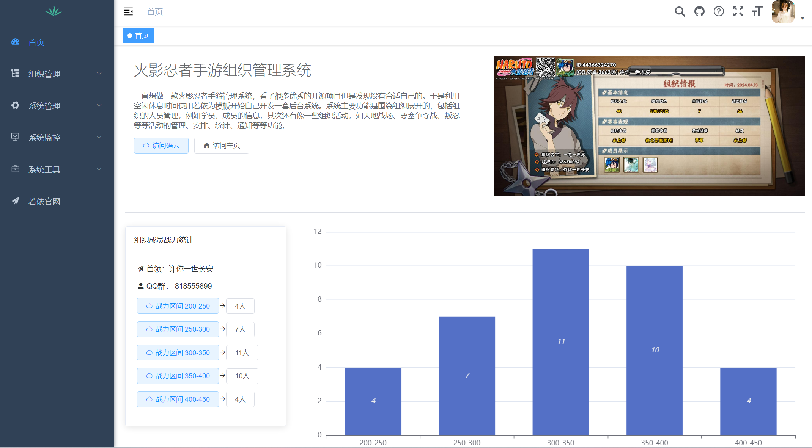
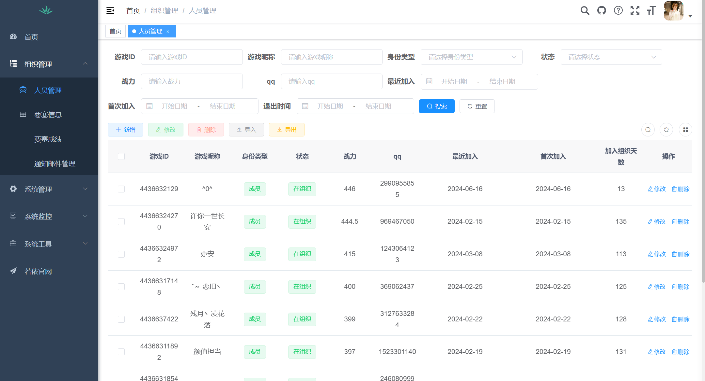
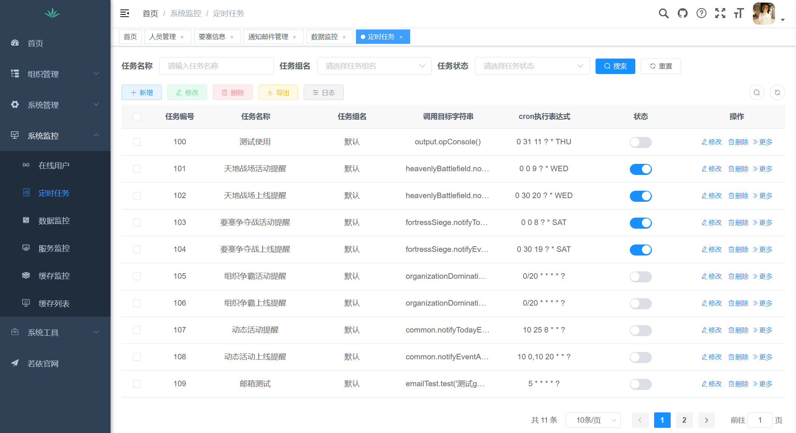

# 火影忍者手游管理系统

## 一、简介

火影忍者手游管理系统是一个用于管理和运营火影忍者手游的后台管理系统。系统提供了包括组织成语管理、战力统计管理、要塞统计、天地战场统计、邮件通知上线等等功能，旨在帮助游戏首领高效管理游戏组织及玩家数据。







。。。自行体验

## 二、功能特点

- **玩家管理**：管理游戏内玩家账号、角色信息及充值记录。
- **游戏内容管理**：管理游戏内道具、任务、活动等内容，支持灵活的配置和更新。
- **运营数据分析**：提供实时和历史的运营数据分析报表，帮助运营团队制定策略和优化运营方案。
- **系统设置**：支持系统参数配置、权限管理、日志查看等管理功能。


## 三、技术栈

[项目基于若依框架开发（前后端分离版）](https://doc.ruoyi.vip/ruoyi-vue/document/spjc.html)


## 四、快速开始

### 1、环境要求

- JDK 1.8+
- Maven 3.0+
- Node.js 10.0+
- MySQL 5.7+
- Redis 3.0+


### 2、配置与部署

1. 克隆项目代码到本地：

   ```bash
   git clone https://github.com/your/repository.git
   ```

2. 启动后端项目：

   - 修改配置文件：配置数据库、Redis连接信息、QQ邮箱、邮箱SMTP服务授权码，文件如下。

     ```
     ruoyi-admin/src/main/resources/application.yml
     ruoyi-admin/src/main/resources/application-druid.yml
     ```

   - 项目先使用IDEA自带的maven插件打包package/安装install，然后启动admin模块

3. 运行前端项目：

   ```bash
   # 进入如下目录内：RuoYi-Vue/ruoyi-ui/ 
   npm install  # 安装依赖
   npm run dev  # 启动前端服务
   ```

4. 访问管理系统：

   默认后台管理系统地址：`http://localhost:8080`


## 五、更新记录

### 2024/7/28

1. 更新组织成员显示列表项
2. 修改统计战力区间人数为只统计在组织的成员
3. 晓组织饰品分配列表添加排序


## 贡献

欢迎热爱火影忍者手游的玩家提交issue和pull request，共同改进本项目，添加需求，改进服务。


## 许可证


